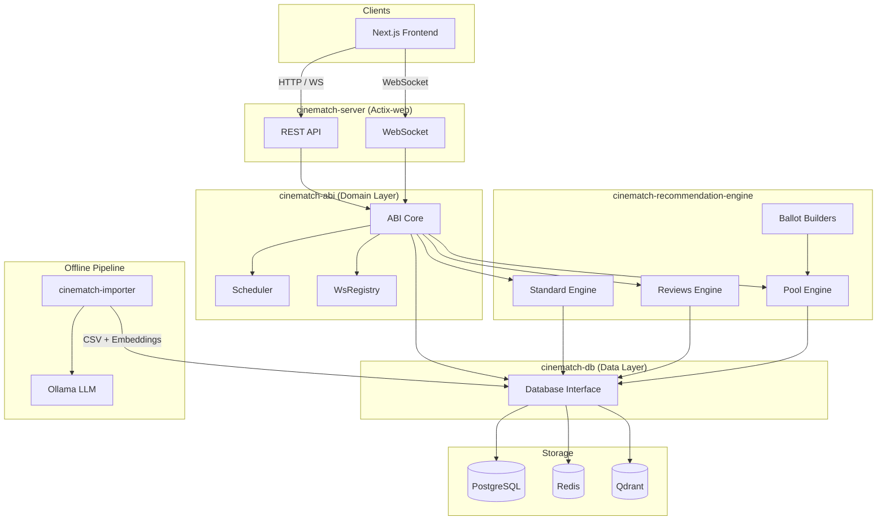

Cinematch Backend
=================

Rust-based movie recommendation and watch-party platform. Users create parties, swipe on movies, vote collectively, and watch as a group — supported by multi-strategy ML recommendations.

Architecture Overview
---------------------



Crate Map
---------

| Crate | Description | Documentation |
|-------|-------------|---------------|
| [`cinematch-server`](cinematch-server/) | HTTP API + WebSocket server. | [README](cinematch-server/README.md) |
| [`cinematch-abi`](cinematch-abi/) | Domain logic, app state, scheduler. | [README](cinematch-abi/README.md) |
| [`cinematch-recommendation-engine`](cinematch-recommendation-engine/) | ML recommendation algorithms. | [README](cinematch-recommendation-engine/README.md) |
| [`cinematch-db`](cinematch-db/) | Database access (Postgres, Redis, Qdrant). | [README](cinematch-db/README.md) |
| [`cinematch-common`](cinematch-common/) | Shared types, config, models. | [README](cinematch-common/README.md) |
| [`cinematch-importer`](cinematch-importer/) | Offline data pipeline CLI. | [README](cinematch-importer/README.md) |

Databases
---------

| Database | Port | Description |
|----------|------|-------------|
| **PostgreSQL 15** | 5432 | Primary relational data (users, parties, movies, votes, ratings). |
| **Redis 7** | 6379 | Session store, candidate caching. |
| **Qdrant** | 6333/6334 | Vector similarity search (4 named embedding vectors per movie). |

For schema details, see [docs/databases.md](docs/databases.md).

Recommendation Algorithm
------------------------

The engine implements multiple strategies (Semantic, Collaborative, Pool-based) contingent on user context. For details, see [docs/algorithm.md](docs/algorithm.md).

Quick Start
-----------

```bash
# 1. Start databases
docker compose up -d

# 2. Import movie data (requires Ollama running on port 11434)
cargo run -p cinematch-importer -- update-all

# 3. Run the server
cargo run -p cinematch-server
```

The API server starts on `http://localhost:8080`. Swagger UI is available at `/swagger-ui/`.
