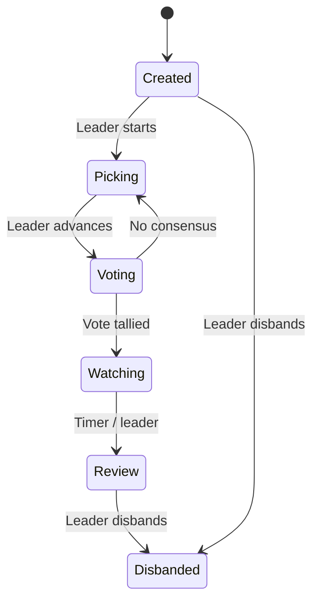

cinematch-common
================

[← Back to main README](../README.md)

Shared types and configuration.

Modules
-------

| Module | Key Types |
|--------|-----------|
| `models` | `PartyState`, `VectorType`, `RecommendationMethod`, `SwipeAction`, `SearchFilter`, `FullUserPreferences`, `ErrorResponse`. |
| `models::movie` | Movie response types. |
| `models::websocket` | WebSocket message types. |
| `config` | Environment-based `Config` struct. |
| `lib.rs` | `HasId` trait. |

`PartyState` Lifecycle
----------------------

`VectorType` Enum
-----------------

Specifies Qdrant embedding vector for similarity search:

- `Plot` → `plot_vector`
- `CastCrew` → `cast_crew_vector`
- `Reviews` → `reviews_vector`
- `Combined` → `combined_vector` (default)
