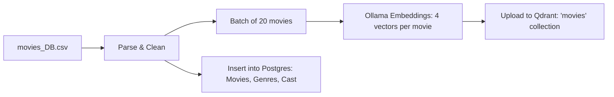

cinematch-importer
==================

[← Back to main README](../README.md)

CLI tool for data ingestion, embedding generation, and onboarding model construction.

Commands
--------

```bash
# Full pipeline: movies + ratings
cargo run -p cinematch-importer -- update-all

# Individual steps
cargo run -p cinematch-importer -- update-movies      # CSV → Ollama → Qdrant + Postgres
cargo run -p cinematch-importer -- update-ratings      # CSV → Sparse vectors → Qdrant
cargo run -p cinematch-importer -- update-onboarding   # CSV → K-Means → Postgres
cargo run -p cinematch-importer -- remove-all          # Wipe Qdrant collections
```

Pipeline: update-movies
-----------------------



Vectors generated via Ollama (`nomic-embed-text`):
- `plot_vector`: Plot synopsis.
- `cast_crew_vector`: Cast & crew names.
- `reviews_vector`: Review text.
- `combined_vector`: Concatenation of all text.

Pipeline: update-onboarding
---------------------------

```mermaid
flowchart TD
    CSV[ratings.csv] --> P1[Pass 1: User stats + movie genre averages]
    P1 --> FILT[Filter: ≥50 ratings/movie, ≥20 ratings/user]
    FILT --> NORM[Z-score normalize per-user genre vectors]
    NORM --> KM[K-Means Clustering: K=200 taste archetypes]
    KM --> CENT[Store cluster centroids in onboarding_clusters]
    
    CSV --> P2[Pass 2: Per-movie rating distributions]
    P2 --> DIST[P(rating_bucket | cluster): 10 buckets × 200 clusters]
    DIST --> SMOOTH[Laplace smoothing: α=0.1]
    SMOOTH --> STORE[Store in onboarding_movies]
```

Prerequisites
-------------

- **Ollama**: `localhost:11434` (required for `update-movies`).
- **Services**: PostgreSQL, Redis, Qdrant.
- **Data**: `data/movies_DB.csv`, `data/ratings.csv`.