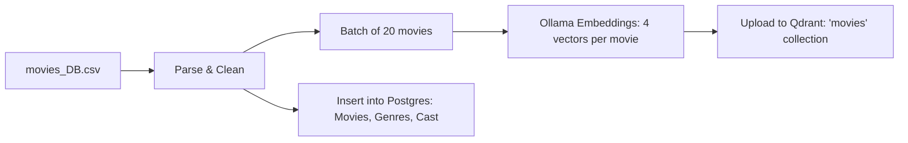

cinematch-importer
==================

[← Back to main README](../README.md)

CLI tool for data ingestion and embedding generation.

Commands
--------

```bash
# Full pipeline: movies + ratings
cargo run -p cinematch-importer -- update-all

# Individual steps
cargo run -p cinematch-importer -- update-movies      # CSV → Ollama → Qdrant + Postgres
cargo run -p cinematch-importer -- update-ratings      # CSV → Sparse vectors → Qdrant
cargo run -p cinematch-importer -- remove-all          # Wipe Qdrant collections
```

Pipeline: update-movies
-----------------------



Vectors generated via Ollama (`nomic-embed-text`):
- `plot_vector`: Plot synopsis.
- `cast_crew_vector`: Cast & crew names.
- `reviews_vector`: Review text.
- `combined_vector`: Concatenation of all text.

Prerequisites
-------------

- **Ollama**: `localhost:11434` (required for `update-movies`).
- **Services**: PostgreSQL, Redis, Qdrant.
- **Data**: `data/movies_DB.csv`, `data/ratings.csv`.