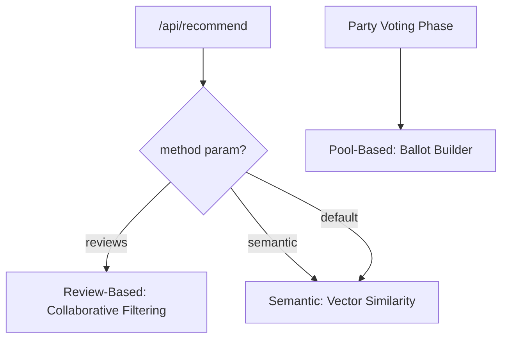
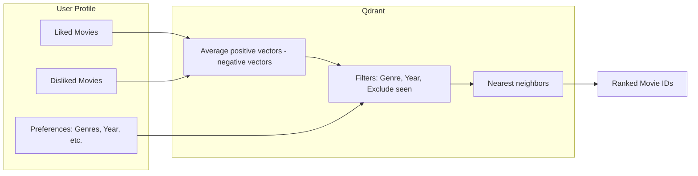
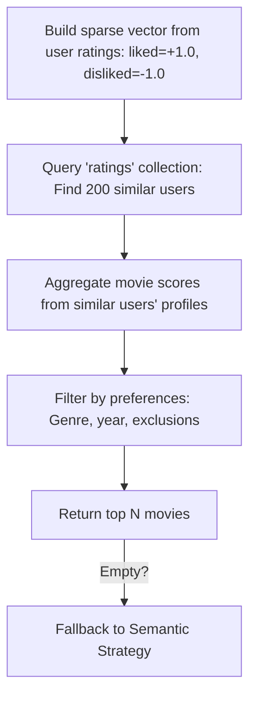
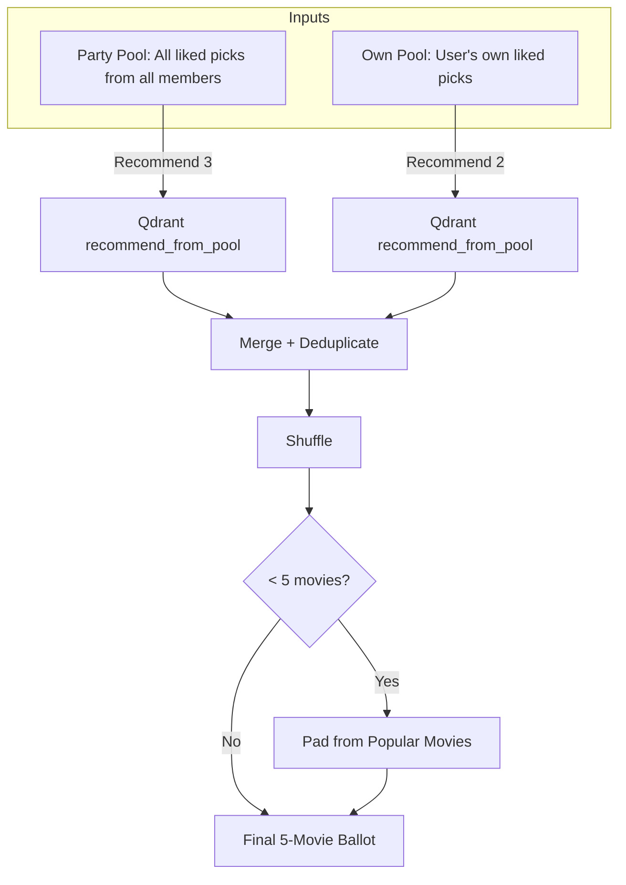
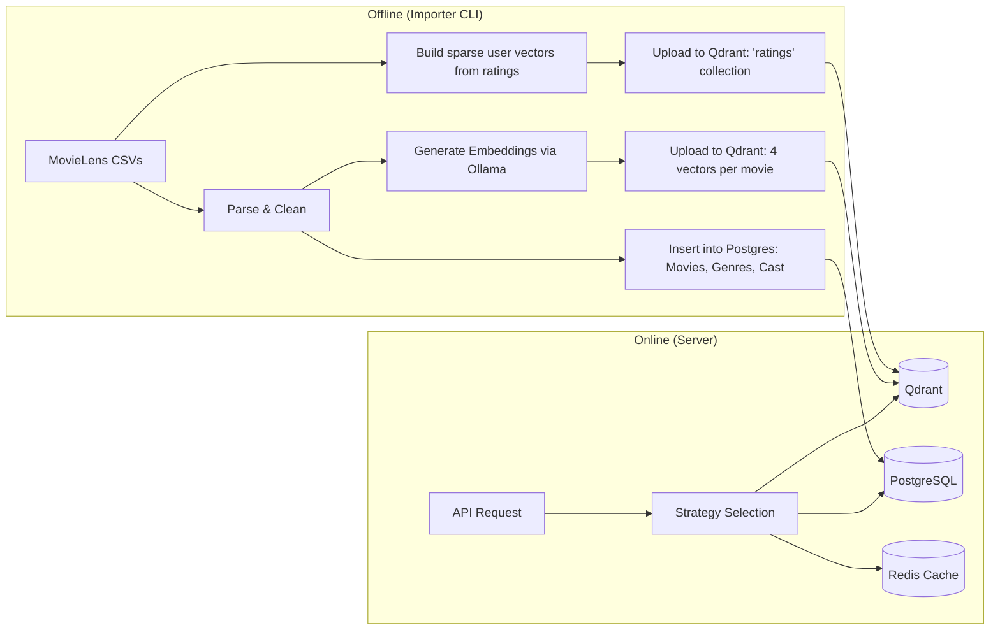

Recommendation Algorithm
========================

[← Back to main README](../README.md)

Cinematch uses three recommendation strategies, selected automatically based on user context (solo vs. party).

Strategy Selection
------------------



1. Semantic Recommendation (Standard Strategy)
--------------------------------------------

Utilizes Qdrant's `RecommendPoints` API with the `AverageVector` strategy.

### Mechanism



### Vector Types

Each movie has 4 named embedding vectors (1024-dim, generated via Ollama) bge-m3 model:

| Vector | Description |
|--------|-------------|
| `plot_vector` | Plot similarity |
| `cast_crew_vector` | Cast/Crew similarity |
| `reviews_vector` | Critical reception similarity |
| `combined_vector` | General purpose (default) |

### Fallback

If no positive ratings exist, the engine uses the top 5 most popular movies as positive seeds.

2. Review-Based Recommendation (Collaborative Filtering)
------------------------------------------------------

**Condition**: User has explicitly requested `method=reviews`.

Uses sparse user-movie vectors in Qdrant's `ratings` collection to identify similar users.

### Mechanism



### Sparse Vector Format

```
user_vector = { movie_1: 1.0, movie_5: -1.0, movie_12: 1.0, ... }
```

Matches users with similar rating patterns and recommends movies liked by those users.

3. Pool-Based Recommendation (Party Voting)
-------------------------------------------

**Condition**: Party transitions from Picking → Voting phase.

Constructs personalized voting ballots for each party member from the shared pool of picked movies.

### Round 1: Initial Ballot



- **3 from party pool**: Group favorites, ranked by personal preference.
- **2 from own pool**: Personal favorites, for diversity.
- Shuffled and padded to exactly 5 movies per ballot.

### Round 2: Top-3 Refinement

After Round 1 tallying, determining the top 3 movies. Each member receives a new ballot of 3 movies from this subset.

Pipeline: Data Ingestion to Recommendation
------------------------------------------



### Importer Commands

| Command | Description |
|---------|-------------|
| `update-all` | Runs `update-movies` + `update-ratings` |
| `update-movies` | CSV → Ollama embeddings → Qdrant `movies` + Postgres |
| `update-ratings` | CSV → Sparse vectors → Qdrant `ratings` collection |
| `remove-all` | Wipe all Qdrant collections |
