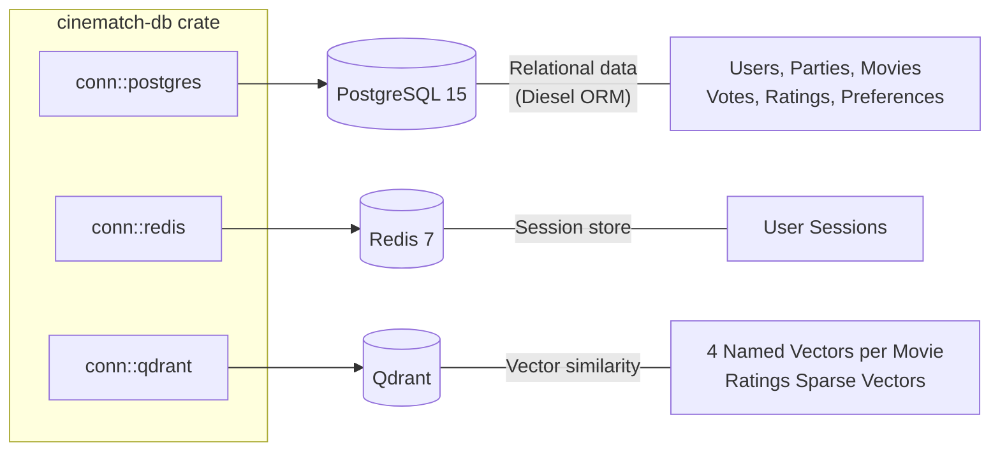
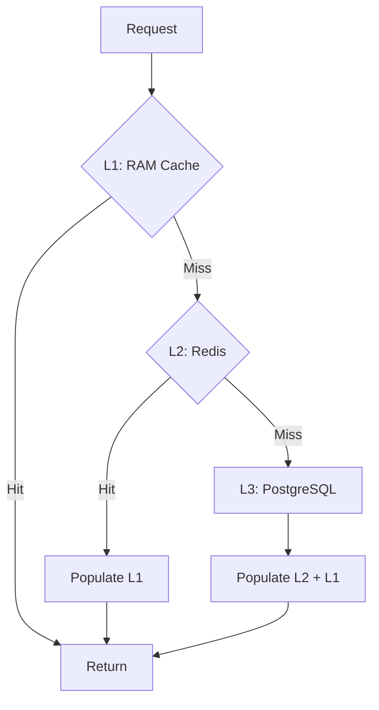
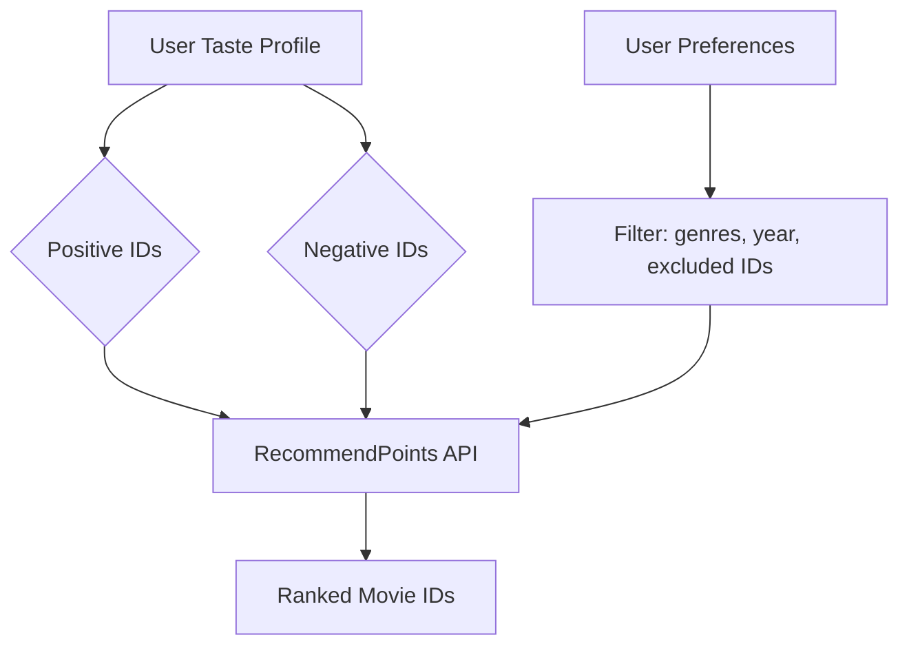

Database Architecture
=====================

[← Back to main README](../README.md)

Cinematch employs three distinct database systems to support its data architecture.

Overview
--------

1. PostgreSQL (Primary Store)
-----------------------------

**ORM**: Diesel (async) with auto-migrations.

### Schema: Core Tables

| Table | Description |
|-------|-------------|
| `users` | User accounts (`id`, `username`, `oneshot` flag for guests). |
| `external_accounts` | OAuth provider linkage. |
| `movies` | Movie metadata (title, runtime, popularity, poster, overview, etc.). |
| `genres`, `movie_genres` | Genre taxonomy and mapping. |
| `cast_members`, `movie_cast` | Cast data. |
| `directors`, `movie_directors` | Director data. |
| `keywords`, `movie_keywords` | Keyword tagging. |
| `trailers`, `movie_trailers` | Trailer video keys. |
| `production_countries` | Country of origin. |

### Schema: Party System

| Table | Description |
|-------|-------------|
| `parties` | Party state machine (`state`, `party_leader_id`, `selected_movie_id`, `voting_round`). |
| `party_codes` | Ephemeral 4-character join codes. |
| `party_members` | Membership tracking and readiness state. |
| `party_picks` | Per-user movie swipes within a party (`liked: bool`). |
| `shown_movies` | Voting ballots; movies displayed to users. |
| `votes` | Binary votes on ballot movies. |
| `schedules` | Timeout event scheduling for phase transitions. |

### Schema: User Data

| Table | Description |
|-------|-------------|
| `user_ratings` | Global taste profile (liked/disliked/rated movies). |
| `user_preferences` | User constraints: year, flexibility, `is_tite`. |
| `prefs_include_genre` | Genre whitelist. |
| `prefs_exclude_genre` | Genre blacklist. |

2. Redis (Session Store)
------------------------

**Client**: `deadpool-redis` connection pool.

### Key Schema

| Key Pattern | TTL | Description |
|-------------|-----|-------------|
| `session:<id>` | 10 days | Actix session data (identity, CSRF). |

### Caching Strategy

3. Qdrant (Vector Search)
-------------------------

**Client**: `qdrant-client` via gRPC.

### Collections

#### `movies` — Semantic Movie Embeddings

Each movie constitutes a point with 4 named vectors, generated by Ollama.

| Vector Name | Source Text | Description |
|-------------|-------------|-------------|
| `plot_vector` | Plot synopsis + overview | Content-based similarity. |
| `cast_crew_vector` | Cast and crew names | Cast/crew similarity. |
| `reviews_vector` | User review text | Sentiment/tone similarity. |
| `combined_vector` | All text concatenated | General-purpose similarity. |

**Payload**: `title`, `genres`, `year`, `runtime`, `popularity`, `country`, `director`, `cast`.

#### `ratings` — Collaborative Filtering Vectors

Sparse user-movie vectors for collaborative filtering. Points represent user rating patterns.

### Recommendation Implementation

The engine employs Qdrant's `RecommendPoints` with the `AverageVector` strategy. It averages liked movie vectors, subtracts disliked vectors, and identifies nearest neighbors in the filtered space.
