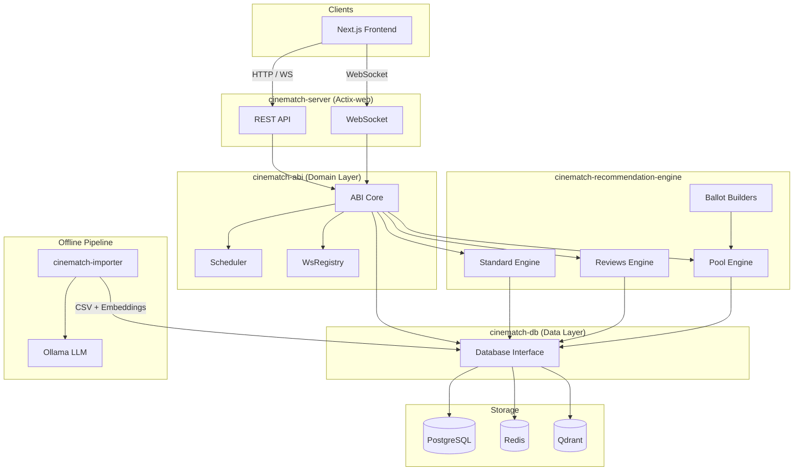
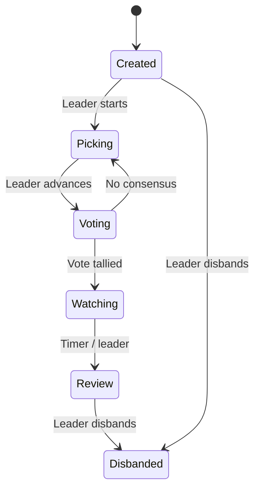
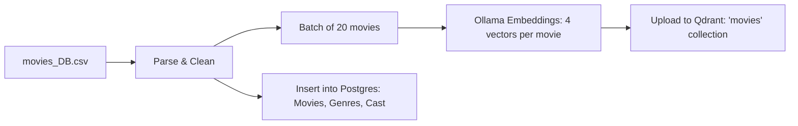

# Backend

## Architecture Overview





## Crate Overviews

### `cinematch-server`


Actix-web HTTP server and WebSocket gateway. Default workspace entry point.

Endpoints
---------

| Scope | Endpoints | Description |
|-------|-----------|-------------|
| `/api/auth` | `POST /login/guest`, `POST /logout` | Guest login, logout. |
| `/api/user` | `GET /me`, `PATCH /rename`, `PATCH /taste`, `GET /pref`, `PUT /pref` | User profile and preferences. |
| `/api/party` | `POST /create`, `GET /`, `POST /join`, `POST /leave`, `GET /members`, `PATCH /ready`, `POST /advance-phase`, `POST /disband` | Party lifecycle management. |
| `/api/party` | `GET /picks`, `POST /pick`, `DELETE /pick`, `GET /vote`, `POST /vote` | Movie picking and voting. |
| `/api/movie` | `GET /:id`, `GET /genres`, `POST /search` | Movie catalog queries. |
| `/api/recommend` | `GET /` | Personalized recommendations. |
| `/api/ws` | WebSocket upgrade | Real-time party updates. |

Features
--------

- **Session Authentication**: `actix-identity` + `actix-session` (Redis-backed).
- **OpenAPI**: Generated via `utoipa`. Available at `/swagger-ui/`.
- **CORS**: Configured for development environment.
- **Compression**: Default middleware enabled.

### `cinematch-db`


Database access layer for PostgreSQL, Redis, and Qdrant. Provides repository abstractions and lazy-loading domain types.

For schema details, see [docs/databases.md](../docs/databases.md).

Structure
---------

```
src/
├── lib.rs          # Database (PG pool + Redis pool + Qdrant client)
├── schema.rs       # Diesel schema
├── models.rs       # Re-exports
├── conn/
│   ├── postgres/   # PG connection helpers
│   ├── redis/      # Redis utilities
│   └── qdrant/     # QdrantService
├── repo/           # Repository layer
│   ├── movie/      # Movie CRUD + search
│   ├── party/      # Party CRUD
│   ├── user/       # User CRUD
│   ├── vote/       # Vote operations
│   ├── taste/      # User taste profile
│   └── schedules/  # Timeout schedules
├── domain/         # Domain types (Extension traits)
│   ├── party.rs    # Party entity logic
│   ├── user.rs     # User entity logic
│   └── movie.rs    # Movie entity logic
└── prelude.rs      # Imports
```

Database Struct
---------------

```rust
pub struct Database {
    pub pool: Pool<AsyncPgConnection>,
    pub redis: RedisPool,
    pub vector: QdrantService,
}
```

Exposes `conn()` and `redis_conn()` for connection acquisition, and `run_migrations()` for startup initialization.

Architecture Constraints
------------------------

- **Raw SQL** MUST be encapsulated within `repo/` modules.
- **No direct DB calls** permitted from `cinematch-server` handlers; `cinematch-abi` domain types MUST be used.
- **Migrations** are embedded via Diesel's `embed_migrations!`.

### `cinematch-common`


Shared types and configuration.

Modules
-------

| Module | Key Types |
|--------|-----------|
| `models` | `PartyState`, `VectorType`, `RecommendationMethod`, `SwipeAction`, `SearchFilter`, `FullUserPreferences`, `ErrorResponse`. |
| `models::movie` | Movie response types. |
| `models::websocket` | WebSocket message types. |
| `config` | Environment-based `Config` struct. |
| `lib.rs` | `HasId` trait. |

`PartyState` Lifecycle
----------------------



`VectorType` Enum
-----------------

Specifies Qdrant embedding vector for similarity search:

- `Plot` → `plot_vector`
- `CastCrew` → `cast_crew_vector`
- `Reviews` → `reviews_vector`
- `Combined` → `combined_vector` (default)

### `cinematch-abi`


Application Business Interface (ABI) layer. Intermediaries between HTTP handlers and the data layer, enforcing business rules and orchestrating cross-cutting concerns.

Structure
---------

```
src/
├── lib.rs           # AppState (AppContext implementation)
├── prelude.rs       # Re-exports
├── domain/
│   ├── recommendation.rs # Recommendation domain model (facade)
│   ├── user.rs          # User domain extensions
│   ├── party/           # Party domain logic & State Machine
│   └── error.rs         # Domain error types
├── scheduler/        # Async timeout scheduler for phase transitions
└── websocket/        # WsRegistry for managing WebSocket connections
```

Responsibilities
----------------

- **`AppState`**: Shared application state injected into Actix handlers. Implements `AppContext` to provide unified access to `Database`, `WsRegistry`, and `Scheduler`.
- **`Recommendation`**: Facade for the `cinematch-recommendation-engine`. Handles strategy selection logic.
- **`Scheduler`**: Manages timeout-based phase transitions (e.g., auto-advancing from Picking to Voting).
- **`WsRegistry`**: Registry of active WebSocket connections for party state broadcasting.

Architecture Constraints
------------------------

Handlers in `cinematch-server` MUST NOT access `cinematch-db` directly. All database interactions MUST traverse `cinematch-abi` domain types or extension traits.

### `cinematch-recommendation-engine`


Core algorithms for movie recommendations.

## Modules

- **`engine`**: Lower-level recommendation functions.
    - `standard`: Qdrant-based vector similarity (AverageVector strategy).
    - `reviews`: Collaborative filtering using sparse user-movie vectors.
    - `pool`: Recommendation restricted to a specific pool of movie IDs.
- **`ballots`**: Logic for party-based voting ballots.
    - `v1`: Initial weighted shuffle of party and personal pools.
    - `v2`: Round-2 top-3 refinement.

## Main API

| Function | Strategy | Description |
|----------|----------|-------------|
| `recommend_movies()` | Semantic | Qdrant `RecommendPoints` with average positive/negative seeds. |
| `recommend_from_reviews()` | Collaborative | Sparse user-movie vectors to find similar users. |
| `recommend_from_pool()` | Pool | Recommendation restricted to a specific list of IDs. |
| `build_voting_ballots_for_party()` | Round 1 | Constructs personalized ballots for party voting. |
| `build_round2_ballots_for_party()` | Round 2 | Refines voting to the top 3 candidates. |

### `cinematch-importer`


CLI tool for data ingestion and embedding generation.

Commands
--------

```bash
# Full pipeline: movies + ratings
cargo run -p cinematch-importer -- update-all

# Individual steps
cargo run -p cinematch-importer -- update-movies      # CSV → Ollama → Qdrant + Postgres
cargo run -p cinematch-importer -- update-ratings      # CSV → Sparse vectors → Qdrant
cargo run -p cinematch-importer -- remove-all          # Wipe Qdrant collections
```

Pipeline: update-movies
-----------------------



Vectors generated via Ollama (`nomic-embed-text`):
- `plot_vector`: Plot synopsis.
- `cast_crew_vector`: Cast & crew names.
- `reviews_vector`: Review text.
- `combined_vector`: Concatenation of all text.

Prerequisites
-------------

- **Ollama**: `localhost:11434` (required for `update-movies`).
- **Services**: PostgreSQL, Redis, Qdrant.
- **Data**: `data/movies_DB.csv`, `data/ratings.csv`.
