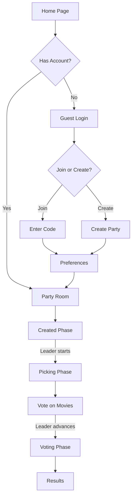

# CineMatch Frontend

A **Next.js 16** movie party application where friends can join together to pick and vote on movies to watch. Built with **React 19**, **TypeScript**, and **Tailwind CSS v4**.

## Overview

CineMatch is a real-time collaborative movie selection platform. Users create or join movie parties, set their preferences, and then go through a picking and voting process to find the perfect film everyone can agree on.

### Key Features

- **Movie Parties** – Create or join rooms with shareable codes
- **Picking Phase** – Swipe through movies to indicate preferences
- **Voting Phase** – Vote on top recommendations as a group
- **Smart Recommendations** – Personalized suggestions based on user preferences
- **Member Management** – Party leaders can kick or promote members
- **Dark Theme** – Sleek cinema-inspired design with red accents

## Tech Stack

| Category | Technology |
|----------|------------|
| Framework | Next.js 16.1.2 (App Router) |
| Language | TypeScript |
| UI | React 19.2.3 |
| Styling | Tailwind CSS 4, tw-animate-css |
| Components | Shadcn UI |
| Icons | Lucide React |
| Forms | Zod validation |
| Data Fetching | SWR |
| Notifications | Sonner |
| API Client | Orval (auto-generated from OpenAPI) |
| Fonts | Geist Sans & Mono |

## Project Structure

```
src/
├── app/                    # Next.js App Router pages
│   ├── page.tsx           # Home – guest login
│   ├── create-party/      # Party creation page
│   ├── party-room/[id]/   # Dynamic party room page
│   ├── preferences/       # User preferences onboarding
│   └── api/               # API routes
├── components/
│   ├── ui/                # Base UI components (Button, Card, Input, etc.)
│   ├── forms/             # GuestLoginForm, CreatePartyForm
│   ├── party/             # Party room components
│   │   ├── picking/       # Movie picking flow (PickingFlow, MovieCard)
│   │   ├── PartyViewClient.tsx
│   │   ├── PartyHeader.tsx
│   │   ├── PartyMemberCard.tsx
│   │   └── PartyMemberList.tsx
│   ├── preferences/       # Preference selection components
│   │   ├── PreferencesFlow.tsx
│   │   ├── GenreSelection.tsx
│   │   ├── DecadeSelection.tsx
│   │   └── StudyStatusSelection.tsx
│   └── common/            # Shared components (ActionConfirmationDialog)
├── actions/               # Next.js Server Actions
│   ├── onboarding.ts      # Guest login, party creation/joining
│   ├── party-room.ts      # Leave, kick, promote, advance phase
│   ├── user-actions.ts    # User preferences
│   └── movie-actions.ts   # Movie interactions
├── server/                # Server-side API wrappers
│   ├── party/             # Party API calls
│   ├── user/              # User API calls
│   ├── movie/             # Movie API calls
│   └── websocket/         # WebSocket connections
├── hooks/
│   └── useMoviePicker.ts  # Movie picking state management hook
├── model/                 # Auto-generated TypeScript types (Orval)
├── lib/                   # Utility functions
└── types/                 # Custom TypeScript definitions
```

## Getting Started

### Prerequisites

- Node.js 20+
- npm, pnpm, or yarn
- Backend API running at `http://localhost:8085` (configurable via `.env`)

### Installation

```bash
# Clone and install dependencies
npm install

# Copy environment variables
cp .env.example .env
```

### Development

```bash
npm run dev
```

Open [http://localhost:3000](http://localhost:3000) in your browser.

### Production Build

```bash
npm run build
npm start
```

## Environment Variables

| Variable | Description |
|----------|-------------|
| `API_URL` | Backend API base URL |

See `.env.example` for the full configuration.

## Application Flow



### Party States

1. **Created** – Members join and set preferences
2. **Picking** – Members swipe through movie recommendations  
3. **Voting** – Group votes on top picks

## Key Components

### `PartyViewClient`
Main party room component with real-time polling, member list, and phase controls.

### `PickingFlow`
Full-screen movie picker using `useMoviePicker` hook. Features like/skip gestures and prefetching.

### `PreferencesFlow`
Multi-step onboarding wizard for genre, decade, and viewing preference selection.

### `useMoviePicker`
Custom hook managing movie queue, prefetching, and API interactions with smart caching.

## API Integration

API types are auto-generated using **Orval** from the backend OpenAPI specification:

```bash
npx orval
```

This generates TypeScript types in `src/model/` from `http://localhost:8085/api-docs/openapi.json`.

## Docker

```bash
# Build image
docker build -t cinematch-frontend .

# Run container
docker run -p 3000:3000 cinematch-frontend
```

## Scripts

| Script | Description |
|--------|-------------|
| `npm run dev` | Start development server |
| `npm run build` | Build for production |
| `npm run start` | Start production server |
| `npm run lint` | Run ESLint |

## License

Private project – React Hackathon 2026
